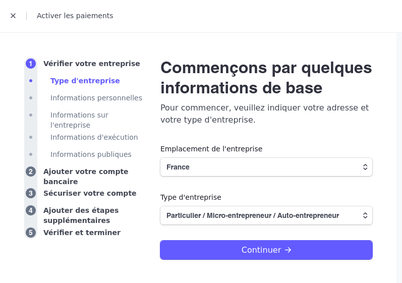

# Jam Project

## Description
Partie back-end d'un projet e-commerce de confitures avec panier, espace d'administration et filtres avancés.

### Technologies employées :
- Symfony 6.2
- API Platform
- Docker 
- Stripe
<br>

Si ZSCALER, copiez les certificats dans le répertoire du projet :
```bash
security export -t certs -f pemseq -k /Library/Keychains/System.keychain -o /docker/php-fpm/certs/certs.crt
cp docker/php-fpm/certs/certs.crt docker/php-fpm/certs/certs.pem
cp docker/php-fpm/certs/certs.crt docker/php-fpm/certs/cert.crt  
cp docker/php-fpm/certs/certs.crt docker/php-fpm/certs/cert.pem
```


Pour initialiser le projet, tapez la commande dans votre terminal :
```bash
make init
```

## Quick start

### 1. Démarrez par vous créer un compte Stripe sur https://dashboard.stripe.com/ <br>
Lorsqu'il vous sera demandé vos informations sur : https://dashboard.stripe.com/account/onboarding/business-structure

Il vous suffit de cliquer sur continuer, vous n'avez rien de plus à remplir pour rendre effectif votre compte.
<br><br>
Puis, <br>
Allez sur  https://dashboard.stripe.com/test/dashboard Votre clé secrète se trouve en bas à droite sur votre dashboard. Ciquez sur l'oeil pour la découvrir.


### 2. Dans /.env.local :<br>
Mettre à jour sa secretkey de Stripe

Accès à la page d'accueil : <br>
http://localhost:8080 <br>

Accès au tableau de bord d'administration : <br>
http://localhost:8080/admin <br>

### User admin
Login : admin@admin.com<br>
Pass : ilovejam<br>